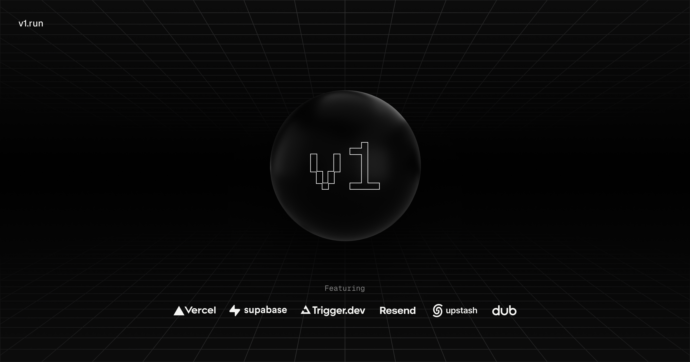

## What's included

Everything you need to build a production ready SaaS, it's a opinionated stack based on learnings from building [Midday](https://midday.ai?utm_source=v1) using the latest Next.js framework, it's a monorepo with a focus on code reuse and best practices that will grow with your business.

- Next.js - Framework
- Turborepo - Build system
- Biome - Linter, formatter
- TailwindCSS - Styling
- Shadcn - UI components
- TypeScript - Type safety
- Supabase - Authentication, database, storage
- Upstash - Cache and rate limiting
- React Email - Email templates
- Resend - Email delivery
- i18n - Internationalization
- Sentry - Error handling/monitoring
- Dub - Sharable links
- Trigger.dev - Background jobs
- OpenPanel - Analytics
- react-safe-action - Validated Server Actions
- nuqs - Type-safe search params state manager
- next-themes - Theme manager

## Prerequisites

- Bun
- Docker
- Upstash
- Dub
- Trigger.dev
- Resend
- Supabase
- Sentry

## Getting Started

First, run the development server:

```bash
bun dev - starts everything in development mode (web, app, api, email)
bun dev:web - starts the web app in development mode
bun dev:app - starts the app in development mode
bun dev:api - starts the api in development mode
bun dev:email - starts the email app in development mode
```